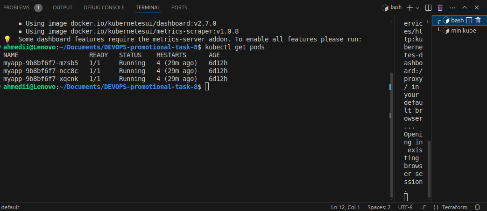
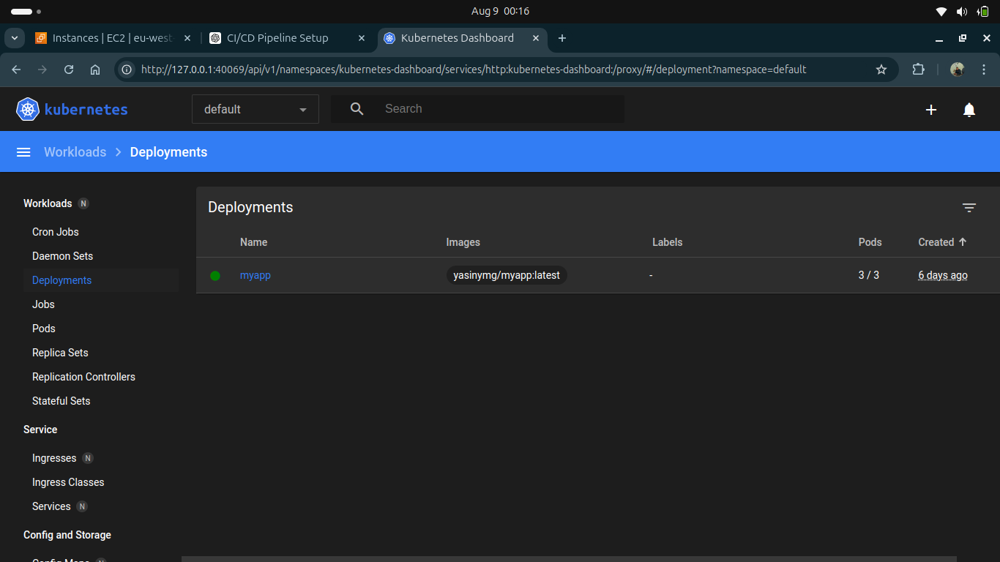
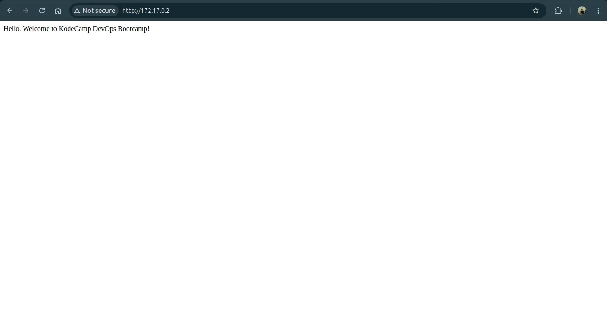

# Minikube Deployment with GitHub Actions and Terraform

This repository contains the code, Docker configurations, Terraform modules, and GitHub Actions workflows necessary to deploy an application to a Minikube cluster running on an EC2 instance using Terraform.

## Table of Contents

- [Overview](#overview)
- [Prerequisites](#prerequisites)
- [Setup Instructions](#setup-instructions)
  - [Step 1: Prepare the Code Repository](#step-1-prepare-the-code-repository)
  - [Step 2: Set Up GitHub Actions](#step-2-set-up-github-actions)
  - [Step 3: Set Up Terraform for EC2 and Minikube](#step-3-set-up-terraform-for-ec2-and-minikube)
  - [Step 4: Access the Minikube Cluster](#step-4-access-the-minikube-cluster)
  - [Step 5: Automate Deployment with GitHub Actions](#step-5-automate-deployment-with-github-actions)
- [Screenshots](#screenshots)

## Overview

This project demonstrates a complete CI/CD pipeline that uses GitHub Actions to deploy an application from a GitHub repository to a Minikube cluster running on an EC2 instance. Terraform is used to provision the infrastructure, including the EC2 instance and the Minikube cluster.

## Prerequisites

- AWS account with IAM permissions to create EC2 instances and VPCs
- GitHub account
- Docker Hub account
- Terraform installed locally
- SSH key pair for EC2 access
- Basic understanding of Kubernetes and Docker

## Setup Instructions

### Step 1: Prepare the Code Repository

1. **Create a GitHub Repository**
   - Create a new repository on GitHub.
   - Clone the repository to your local machine.

2. **Add Application Code**
   - Add your application code to the repository.
   - Ensure you have a `Dockerfile` in the root of your application directory.

3. **Push Docker Image to Registry**
   - Build and push your Docker image to Docker Hub.

4. **Create Kubernetes Manifests**
   - Add Kubernetes manifests (e.g., `deployment.yaml`, `service.yaml`) to a `k8s` directory in the repository.

### Step 2: Set Up GitHub Actions

1. **Create a GitHub Actions Workflow**
   - Create a `.github/workflows/deploy.yml` file.
   - Define the steps to build the Docker image, push it to Docker Hub, and deploy it to Minikube.

   name: Deploy to Minikube

on:
  push:
    branches:
      - main

jobs:
  build:
    runs-on: ubuntu-latest

    steps:
    - name: Checkout code
      uses: actions/checkout@v2

    - name: Set up Docker Buildx
      uses: docker/setup-buildx-action@v1

    - name: Log in to Docker Hub
      uses: docker/login-action@v1
      with:
        username: ${{ yasinymg }}
        password: ${{ @Fathia39730353 }}

    - name: Build and push Docker image
      run: |
        docker build -t yasinymg/kcapp:latest .
        docker push yasinymg/kcapp:latest 

    - name: SSH into EC2 and deploy to Minikube
      uses: appleboy/ssh-action@v0.1.1
      with:
        host: ${{ secrets.EC2_PUBLIC_IP }}
        username: ec2-user
        key: ${{ secrets.EC2_SSH_KEY }}
        script: |
          kubectl apply -f k8s/deployment.yaml
          kubectl apply -f k8s/service.yaml

### Step 3: Set Up Terraform for EC2 and Minikube

1. **Create Terraform Modules**
   - Create Terraform modules for EC2, VPC, and other resources.
   - Define the infrastructure in `main.tf`.

2. **Initialize and Apply Terraform**
   - Run `terraform init` and `terraform apply` to provision the infrastructure.

### Step 4: Access the Minikube Cluster

1. **SSH into EC2 Instance**
   - SSH into the EC2 instance using the public IP output from Terraform.

2. **Configure kubectl**
   - Configure `kubectl` to use the Minikube cluster.

### Step 5: Automate Deployment with GitHub Actions

1. **Update GitHub Actions Workflow**
   - Update the workflow to deploy your application to the Minikube cluster on the EC2 instance.

## Screenshots

- EC2 instance creation and access

- Minikube cluster running

- Successful deployment via GitHub Actions

- Application running on Minikube

---

